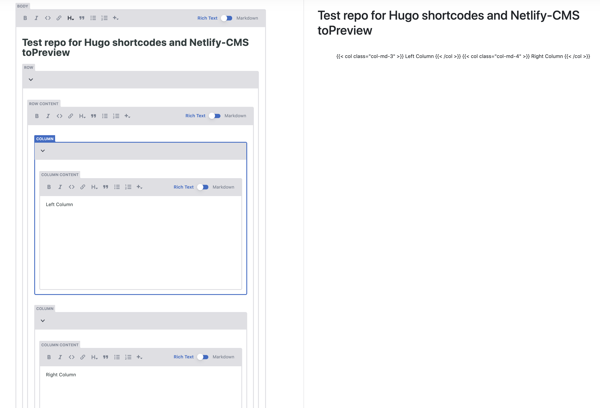

# Test repo for nested hugo shortcodes with Netlify-CMS

Netlify-CMS `registerEditorComponent` supports nested components in the `fromBlock` and the `toBlock` functions, but not in `toPreview`.

Refer to https://github.com/netlify/netlify-cms/issues/1452 for more context.

## To run:

1. In this repo, run `npx netlify-cms-proxy-server` in a terminal
2. Run `hugo server` in a different terminal
3. Navigate to http://localhost:1313/content-admin

